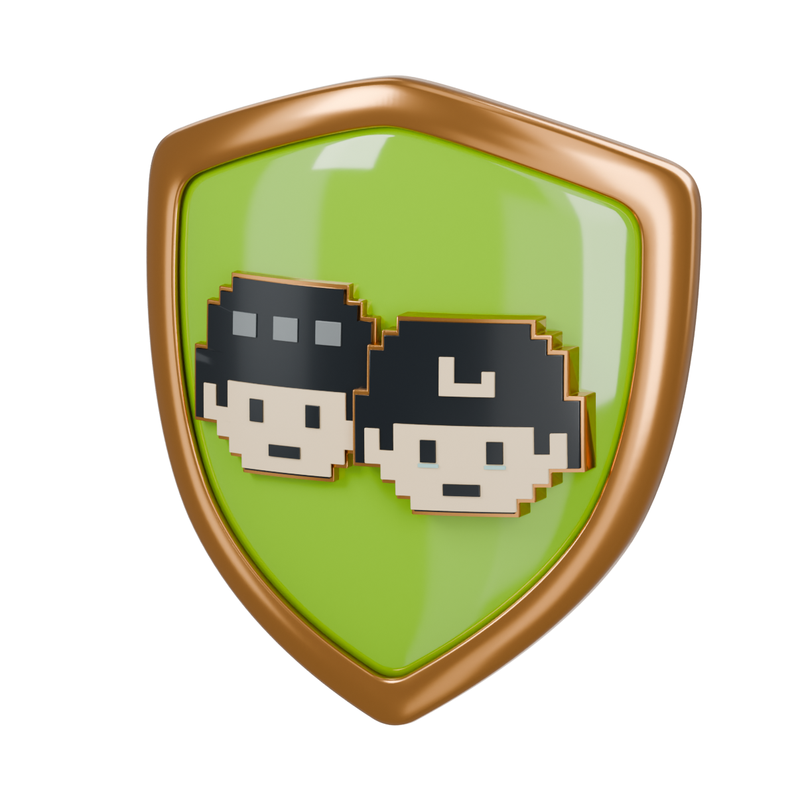
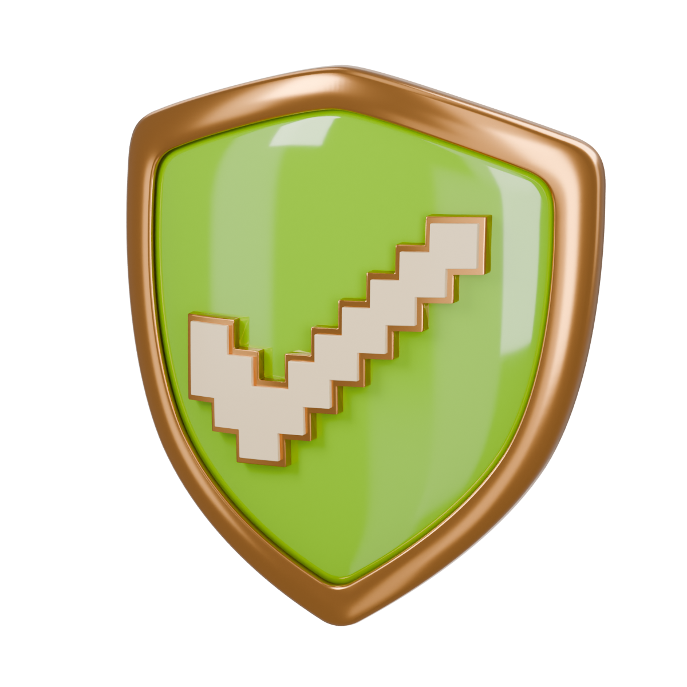
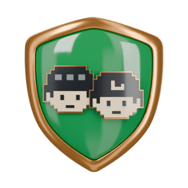
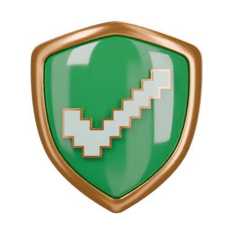
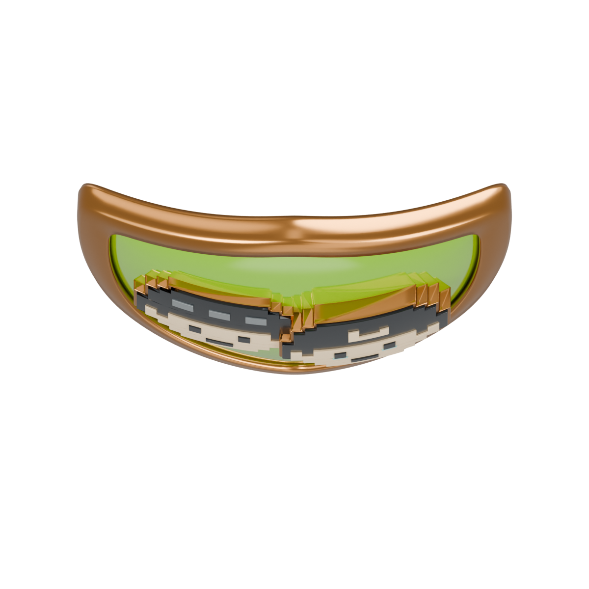
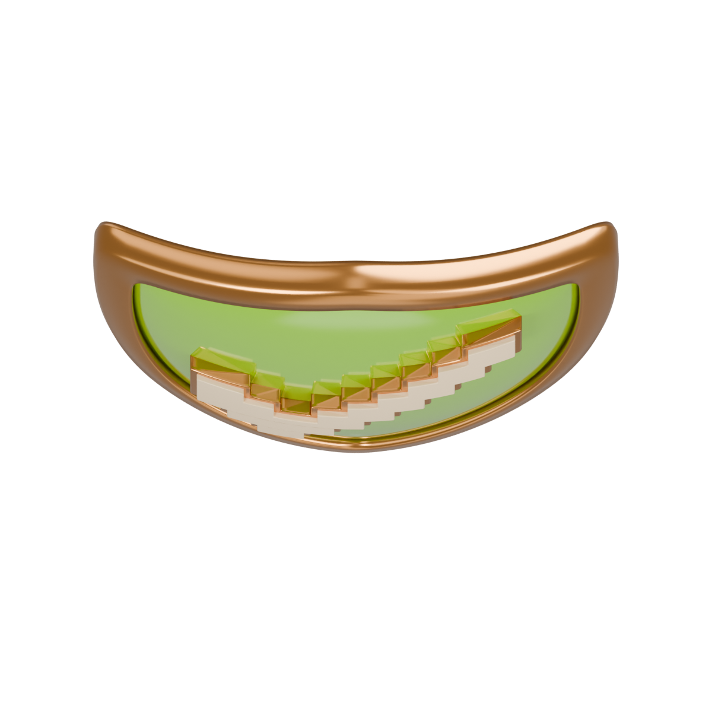
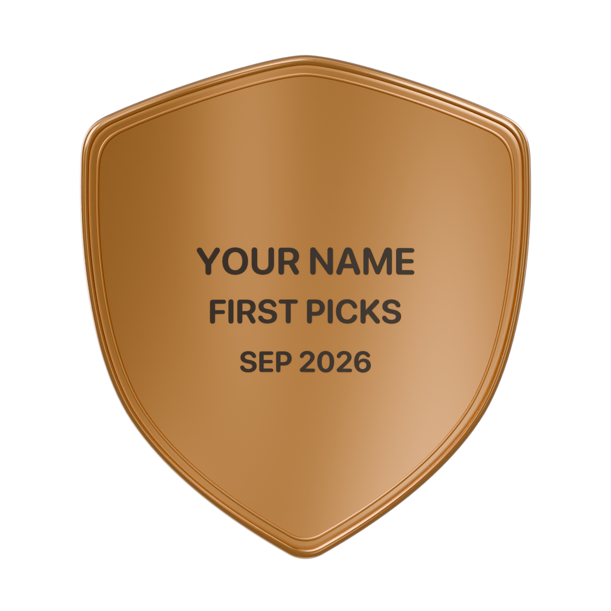

# Getting Started: three actual shield medals

First Agent, First Follow, and First Picks share the same revised curved
shield. The left and right sides wrap farther back around the vertical axis;
the top-to-bottom bow remains subtle. The two sibling builders reuse the
First Agent geometry and materials directly, changing only the emblem and
award identity.

These are actual reimported USDZ renders. Sample engraving is for review only
and is excluded from the exported files.

| First Agent | First Follow | First Picks |
| --- | --- | --- |
|  |  |  |
| [Blender](first-agent/first-agent.blend) · [USDZ](first-agent/first-agent.usdz) | [Blender](first-follow/first-follow.blend) · [USDZ](first-follow/first-follow.usdz) | [Blender](first-picks/first-picks.blend) · [USDZ](first-picks/first-picks.usdz) |

## Front views

| First Agent | First Follow | First Picks |
| --- | --- | --- |
|  |  |  |

## Horizontal bow, viewed from above

| Previous First Agent | Revised First Agent |
| --- | --- |
|  |  |

Revision 4 increases horizontal bow depth about 2.6 times over revision 2,
while preserving the top-to-bottom curve. Every emblem layer now follows the
same surface, including the faces, hair, small details, and checkmark.

## Curved front emblems

| First Agent | First Follow | First Picks |
| --- | --- | --- |
|  |  |  |

## Curve and back

| Shared curve, First Agent | First Follow back | First Picks back |
| --- | --- | --- |
|  |  |  |

The previous First Agent bow is preserved in
`first-agent/revisions/r1-gentle-bow/` for comparison.

## Validation and delivery boundary

Each export has independent checks for closed outward geometry, material
bindings, exact curved backing, front/back orientation, and absence of studio
lighting or sample text. `shield-family-verification.json` compares the four
common body meshes, normals, and material values across all three exports.

The models are not yet integrated or exercised in WagerProof's RealityKit
renderer. The other five medal families remain approved concepts.

Revision 4 exports preserve dense curved emblem geometry for visual review.
These are editable review masters; mesh reduction and on-device performance
validation remain part of app integration.
