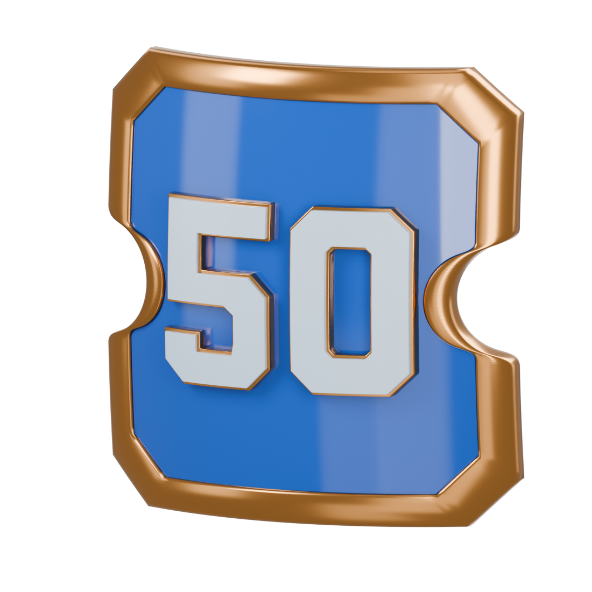
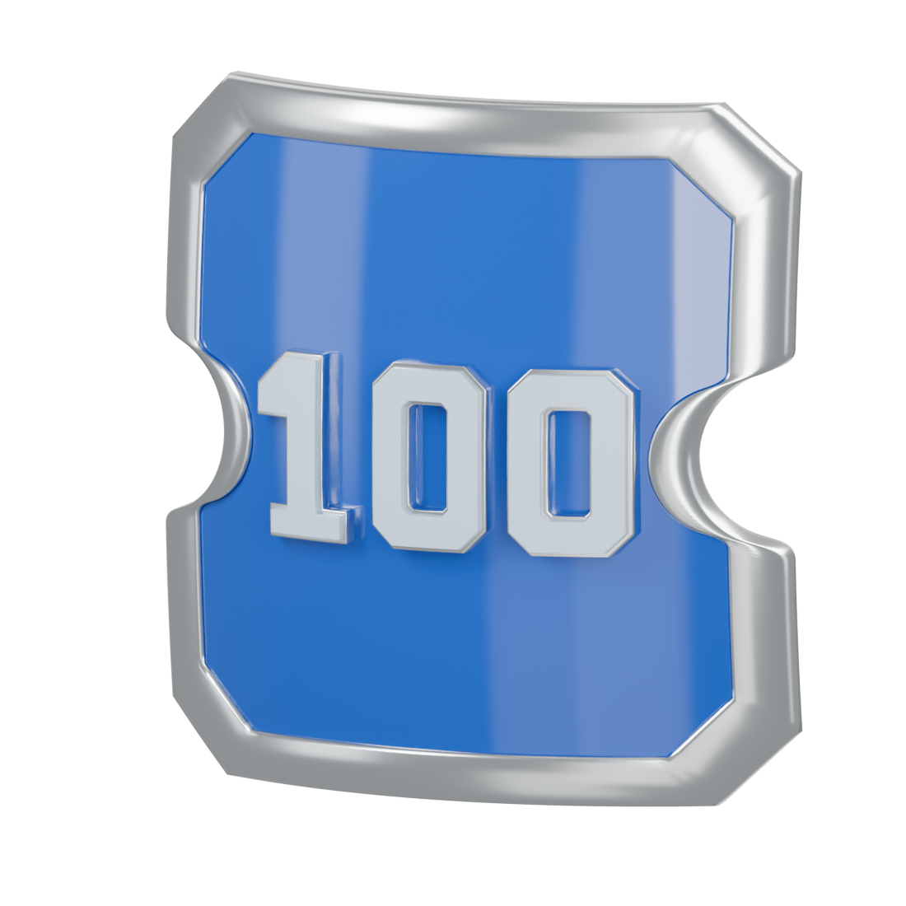
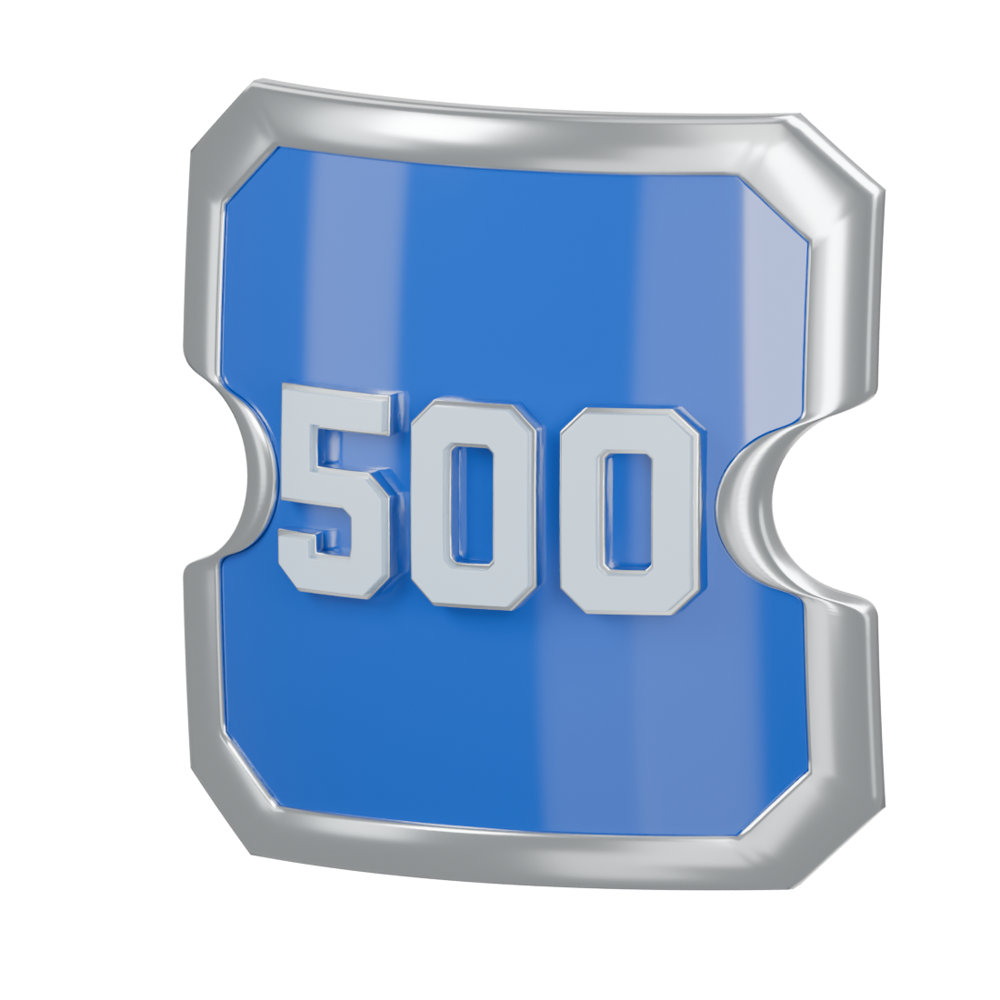
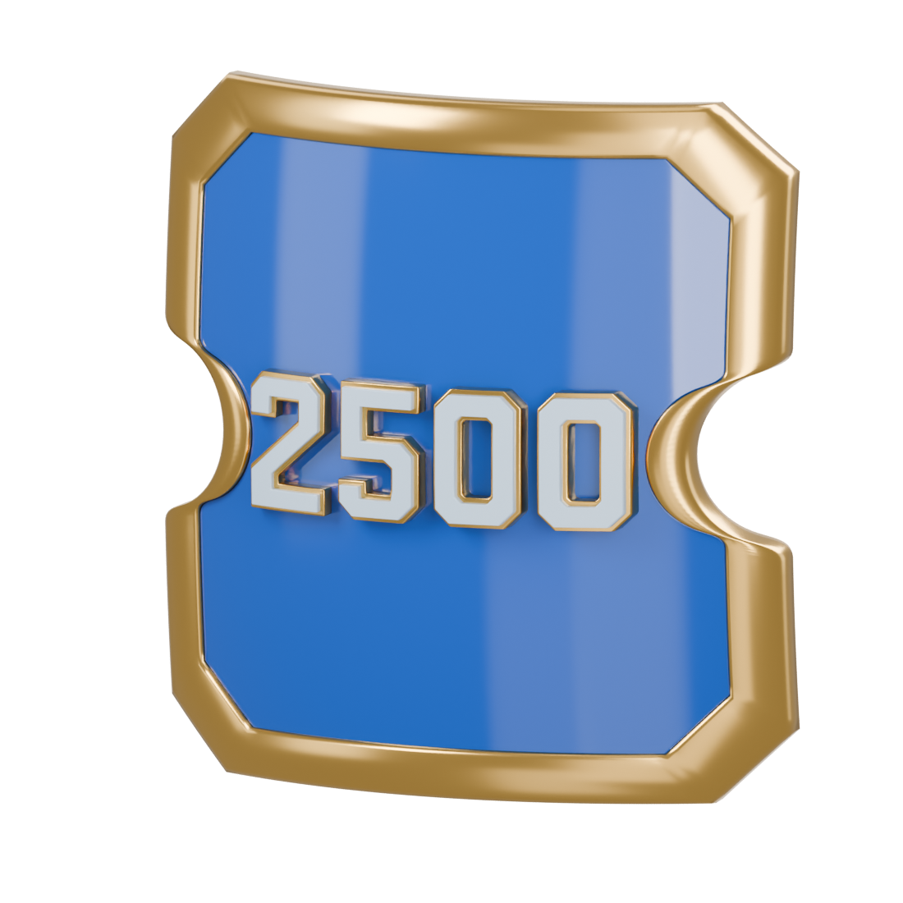

# Experience medals

Actual Blender models and reimported USDZ renders. Bodies, reverse, and front details share the approved bow.

## 10 GRADED PICKS

[Blender](experience-10/experience-10.blend) · [USDZ](experience-10/experience-10.usdz)

## 50 GRADED PICKS

[Blender](experience-50/experience-50.blend) · [USDZ](experience-50/experience-50.usdz)

## 100 GRADED PICKS

[Blender](experience-100/experience-100.blend) · [USDZ](experience-100/experience-100.usdz)

## 500 GRADED PICKS

[Blender](experience-500/experience-500.blend) · [USDZ](experience-500/experience-500.usdz)

## 1,000 GRADED PICKS

[Blender](experience-1000/experience-1000.blend) · [USDZ](experience-1000/experience-1000.usdz)

## 2,500 GRADED PICKS

[Blender](experience-2500/experience-2500.blend) · [USDZ](experience-2500/experience-2500.usdz)

## 5,000 GRADED PICKS

[Blender](experience-5000/experience-5000.blend) · [USDZ](experience-5000/experience-5000.usdz)

Review assets only. Runtime integration and device testing remain later work.
