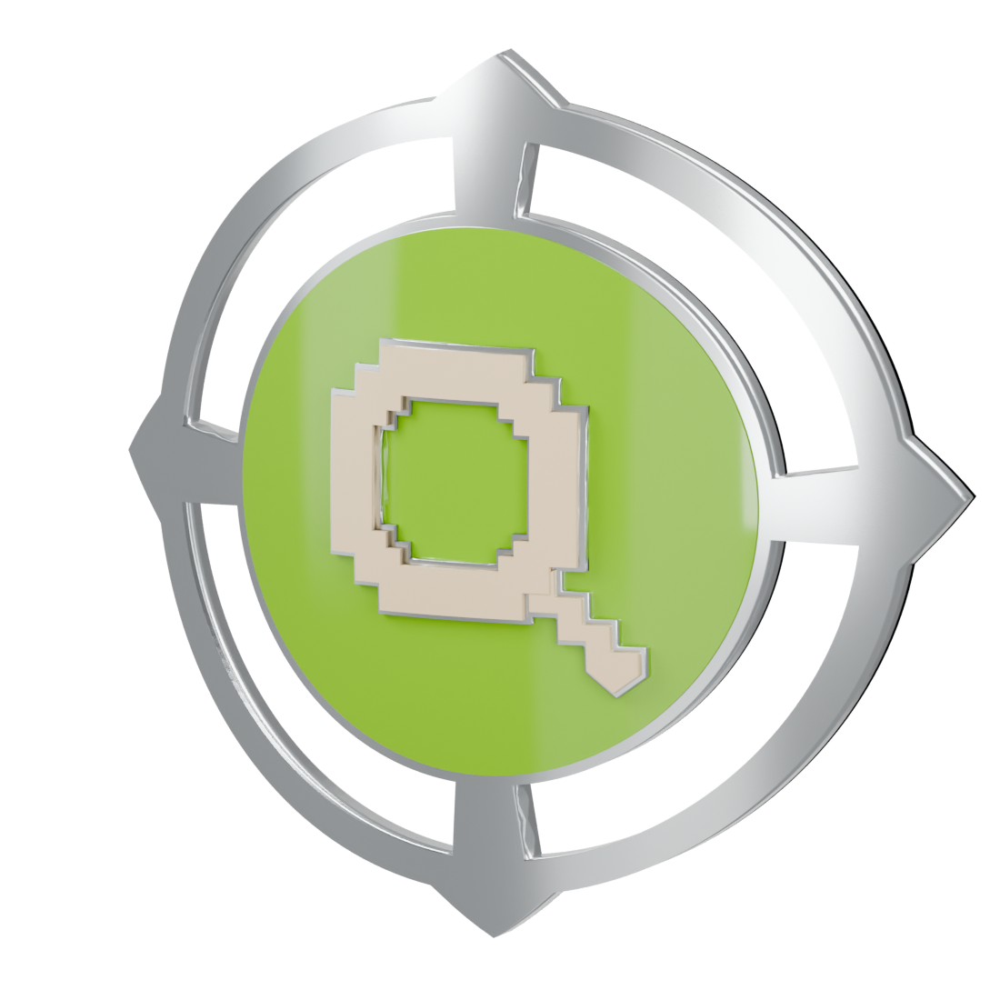
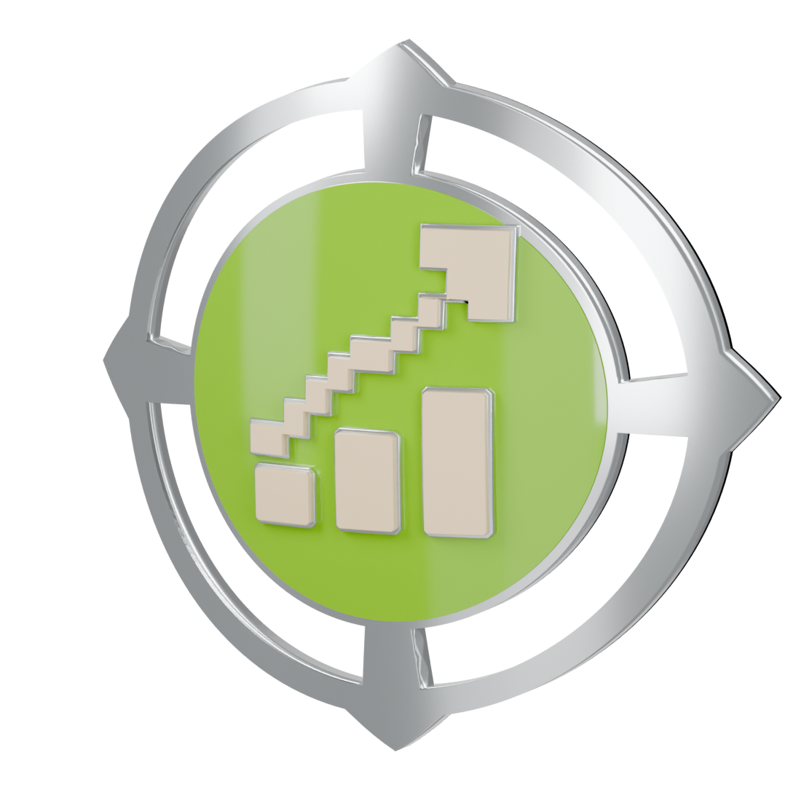
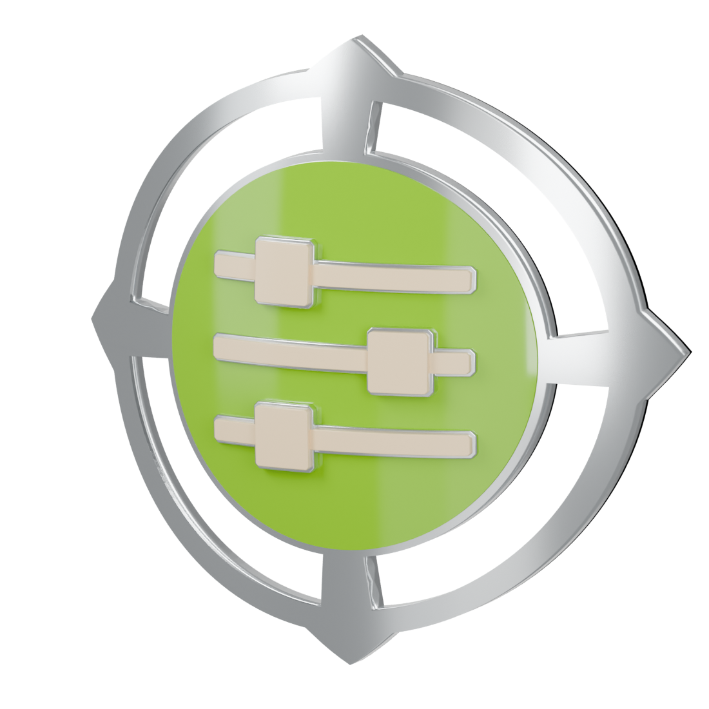
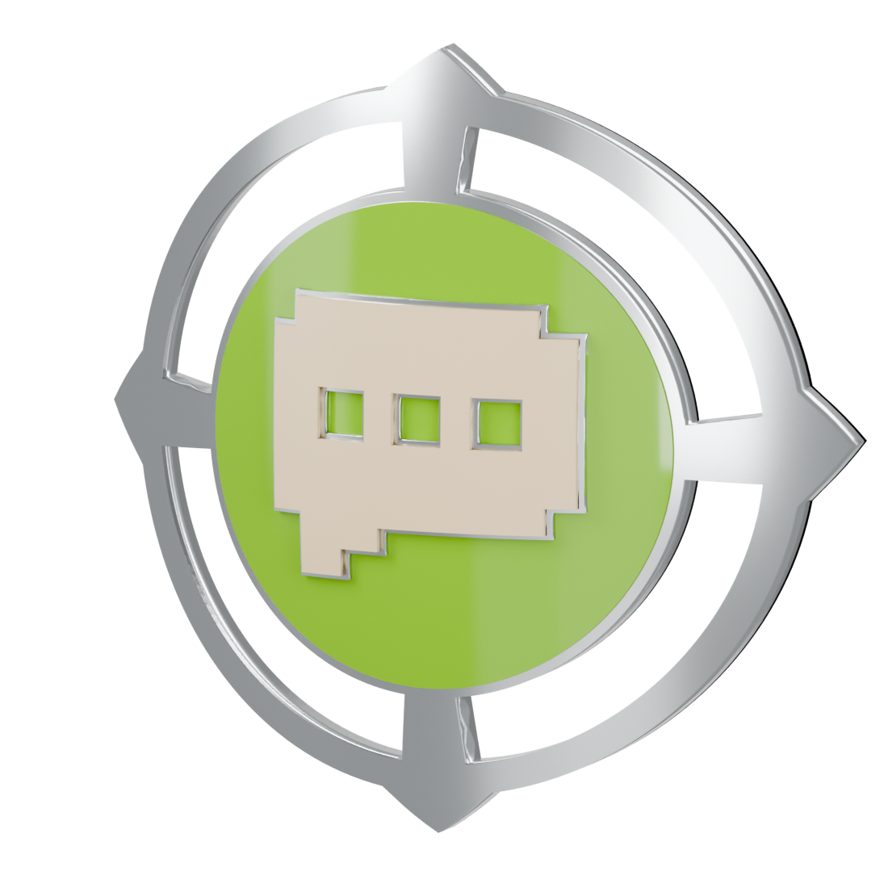
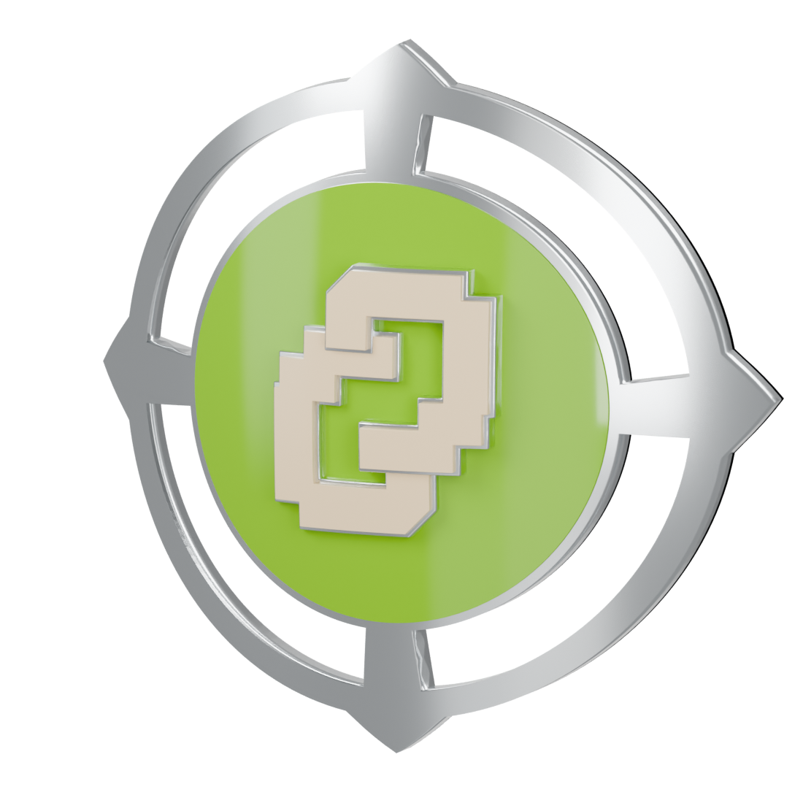

# Exploration medals

Actual Blender models and reimported USDZ renders. Bodies, reverse, and front details share the approved bow.

## GAME ANALYST

[Blender](game-analyst/game-analyst.blend) · [USDZ](game-analyst/game-analyst.usdz)

## PROPS SCOUT

[Blender](props-scout/props-scout.blend) · [USDZ](props-scout/props-scout.usdz)

## TREND EXPLORER

[Blender](trend-explorer/trend-explorer.blend) · [USDZ](trend-explorer/trend-explorer.usdz)

## SYSTEM BUILDER

[Blender](system-builder/system-builder.blend) · [USDZ](system-builder/system-builder.usdz)

## WAGERBOT PARTNER

[Blender](wagerbot-partner/wagerbot-partner.blend) · [USDZ](wagerbot-partner/wagerbot-partner.usdz)

## CONNECTED RESEARCHER

[Blender](connected-researcher/connected-researcher.blend) · [USDZ](connected-researcher/connected-researcher.usdz)

Review assets only. Runtime integration and device testing remain later work.
