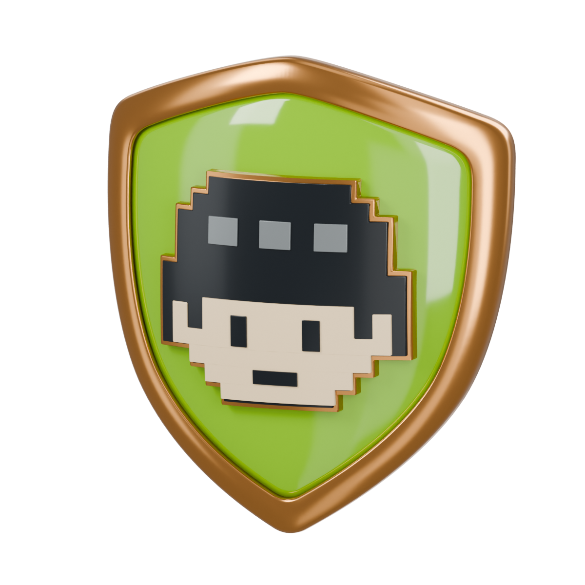
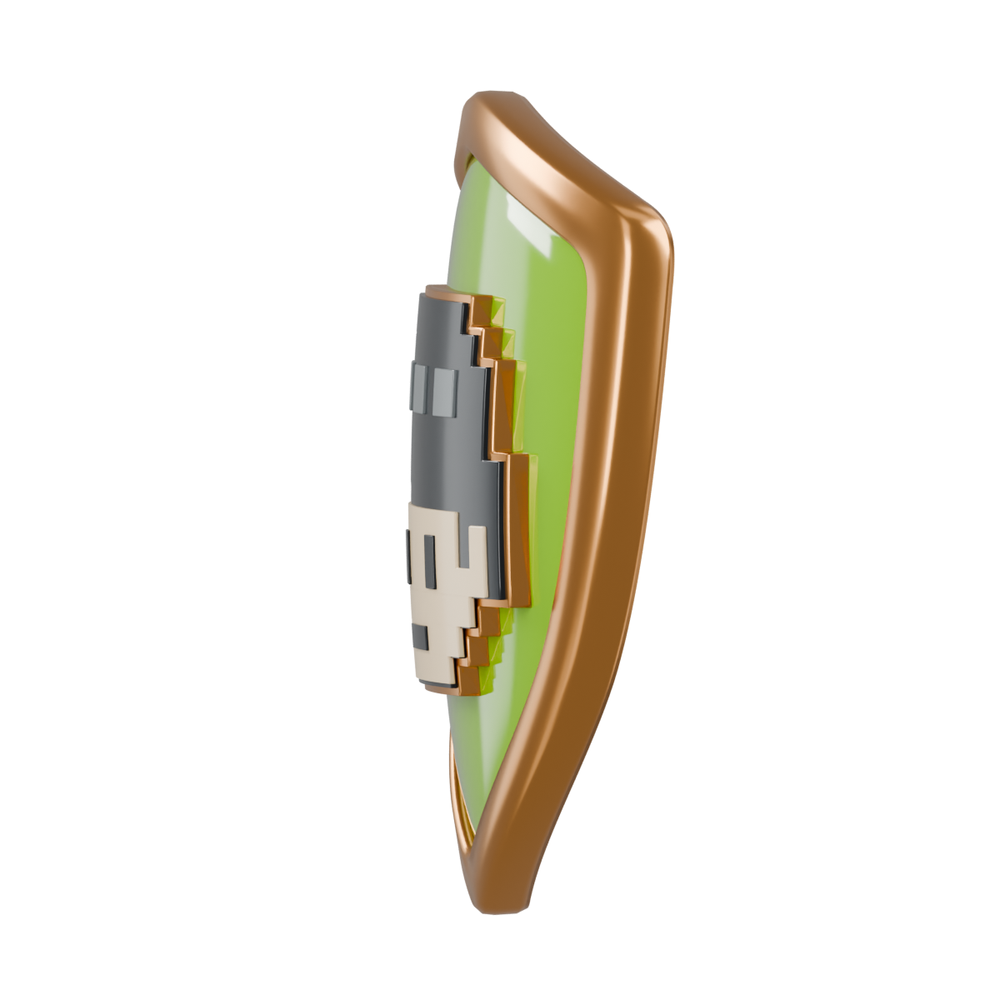
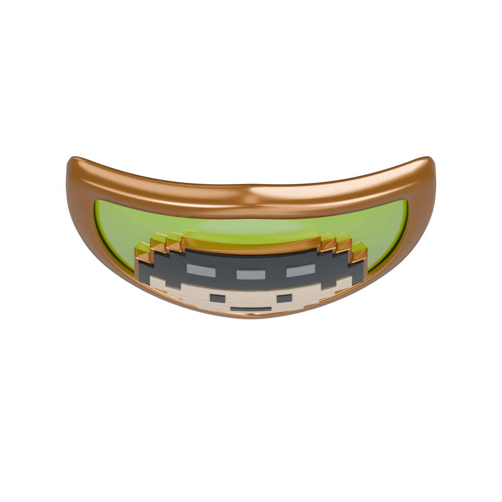

# First Agent: actual model review

The approved pixel-agent shield is now an editable Blender model with a
separate USDZ export. Revision 4 increases wrap around the vertical axis:
the left and right edges recede about 2.6 times as far as revision 2, while the vertical bow stays
unchanged. The shield and reverse follow the same ellipsoidal bow;
the pixel emblem keeps its crisp steps while every raised layer follows the same bow.

These images are rendered from the reimported USDZ. The sample back text is
added only for review and is not baked into the export.

| Front | Angle |
| --- | --- |
|  |  |

| Curved side profile | Sample engraved back |
| --- | --- |
|  |  |

| Previous bow from above | Revised bow from above |
| --- | --- |
|  |  |

[Editable Blender master](first-agent.blend) · [USDZ](first-agent.usdz)

## Physical construction

- Base curvature radius: 5.6 normalized units, with horizontal curvature
  weight 3.8. Exact surface equations are in the manifest.
- Nominal backing thickness: 0.095 units, about 2.7 mm at that size.
- The rim and raised pixel head add local relief above the curved shell.
- Separate bronze, satin bronze, lime acrylic, ivory, charcoal, and highlight
  materials remain editable. Names and earned dates remain runtime data.

## Verification boundary

The builder and independent USD reader check closed outward mesh parts,
material bindings, orientation, curved rear anchors, and exclusion of
sample text. The exported model is reimported for these views. This is the
asset review checkpoint; WagerProof RealityKit integration remains later work.
