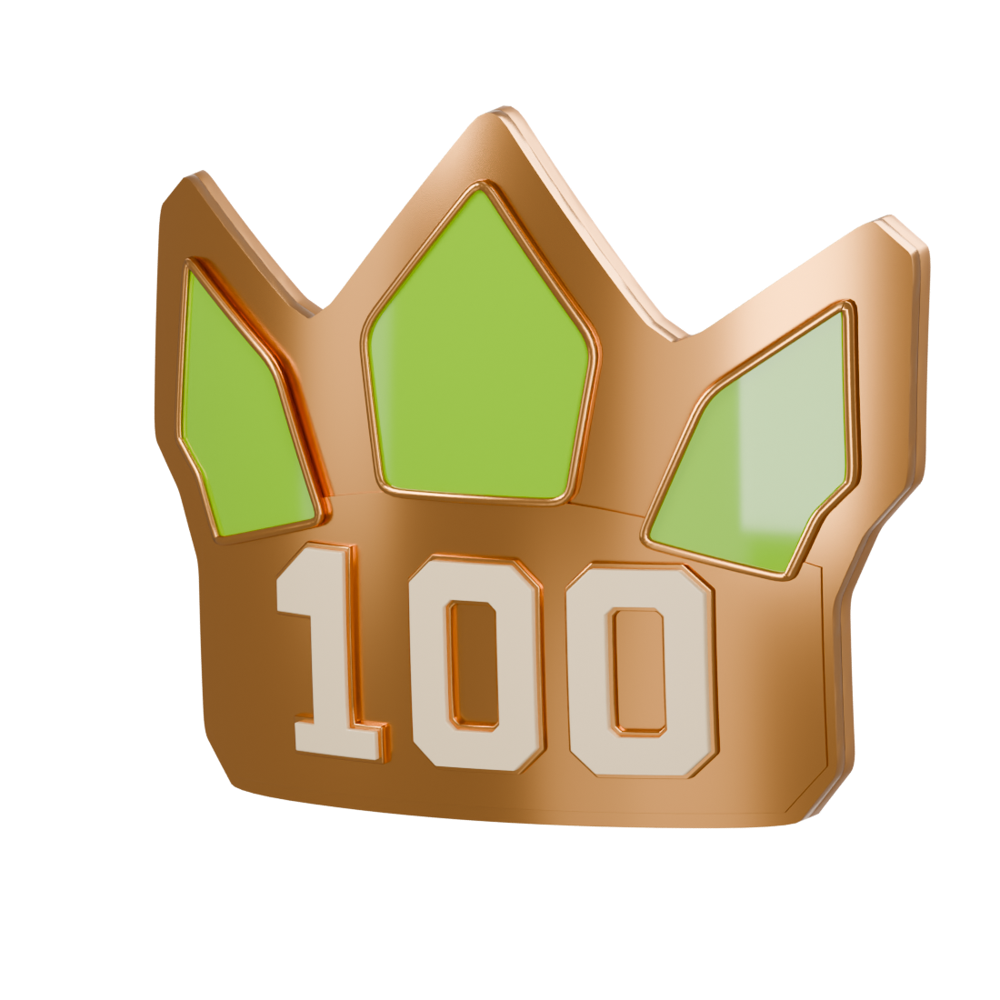
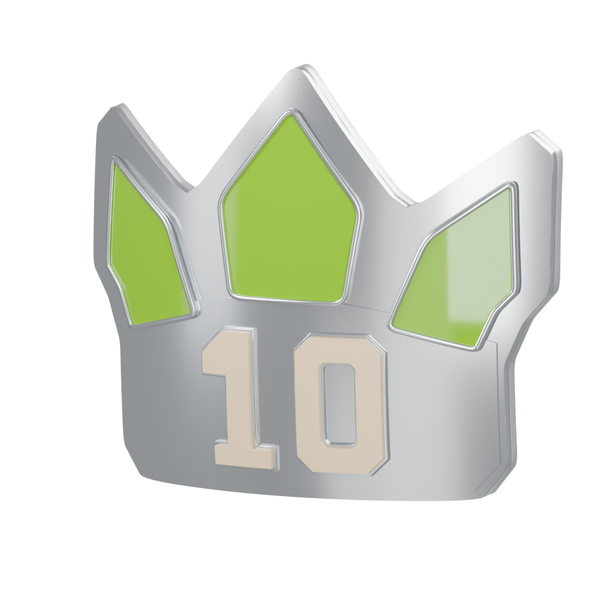

# Leaderboard medals

Actual Blender models and reimported USDZ renders. Bodies, reverse, and front details share the approved bow.

## TOP 100

[Blender](top-100/top-100.blend) · [USDZ](top-100/top-100.usdz)

## TOP 10

[Blender](top-10/top-10.blend) · [USDZ](top-10/top-10.usdz)

## NUMBER ONE

[Blender](number-one/number-one.blend) · [USDZ](number-one/number-one.usdz)

All three exported USDZs passed closed/outward source and reimport mesh checks, finite point/normal checks, Y-up orientation, and material-binding checks. Studio objects and sample engraving are excluded from exports. Final front/angle views were inspected across all tiers; Top 100 also has top/back proof views confirming the bow and readable rear sample text. The three acrylic cells have separate raised polished rims, and numeral counters remain open.

Reproduce with `scripts/build-leaderboard-medals.py` and the shared `scripts/medal_studio.py`. Each variant includes a packed editable Blender file and a standalone USDZ. Rear anchors use the `Top100`, `Top10`, or `NumberOne` prefix and `_Back_Engraving`, `_Back_Name`, `_Back_Caption`, `_Back_Date` suffixes. All shell, panel, band, and numeral surfaces follow the same curved profile.

Review assets only. Runtime integration and device testing remain later work.
