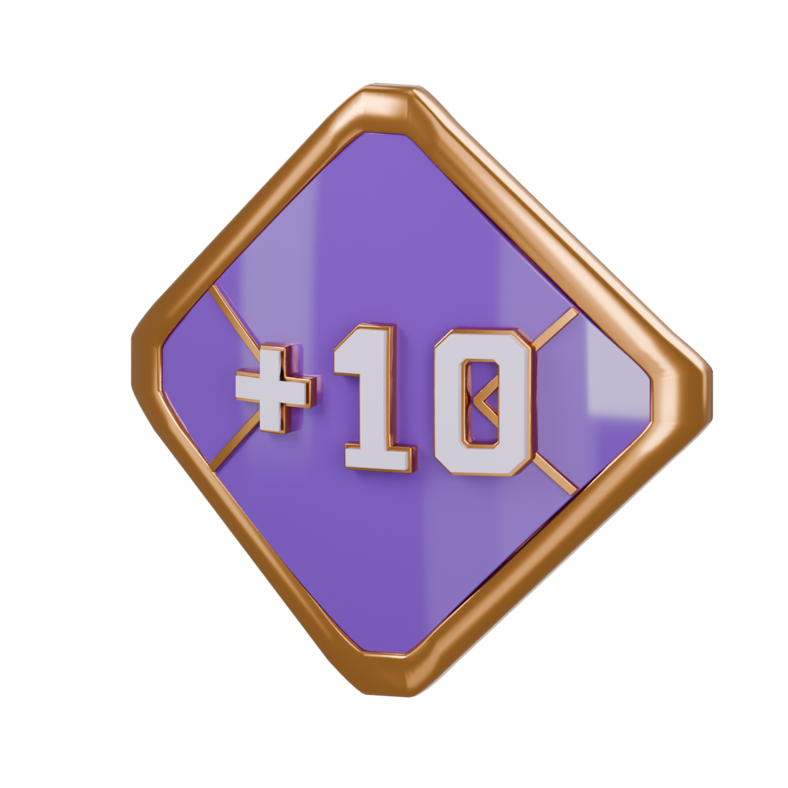
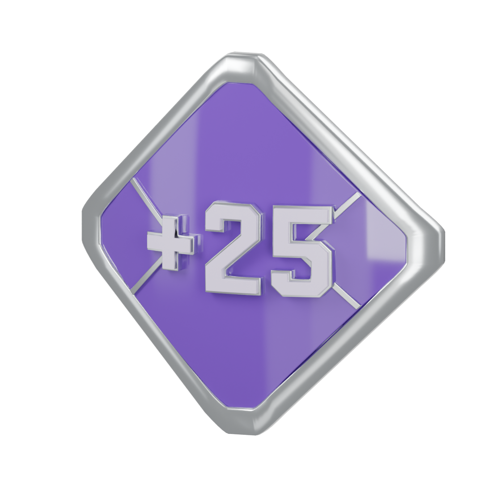
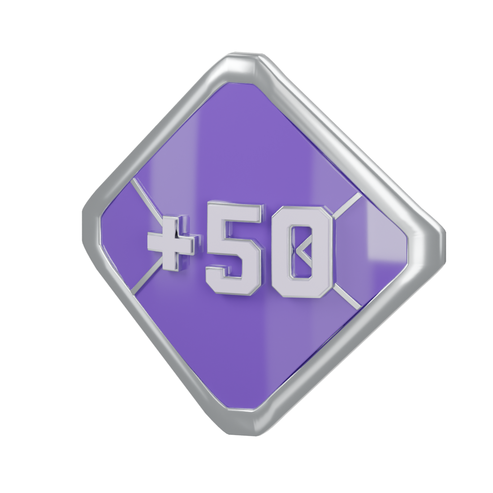
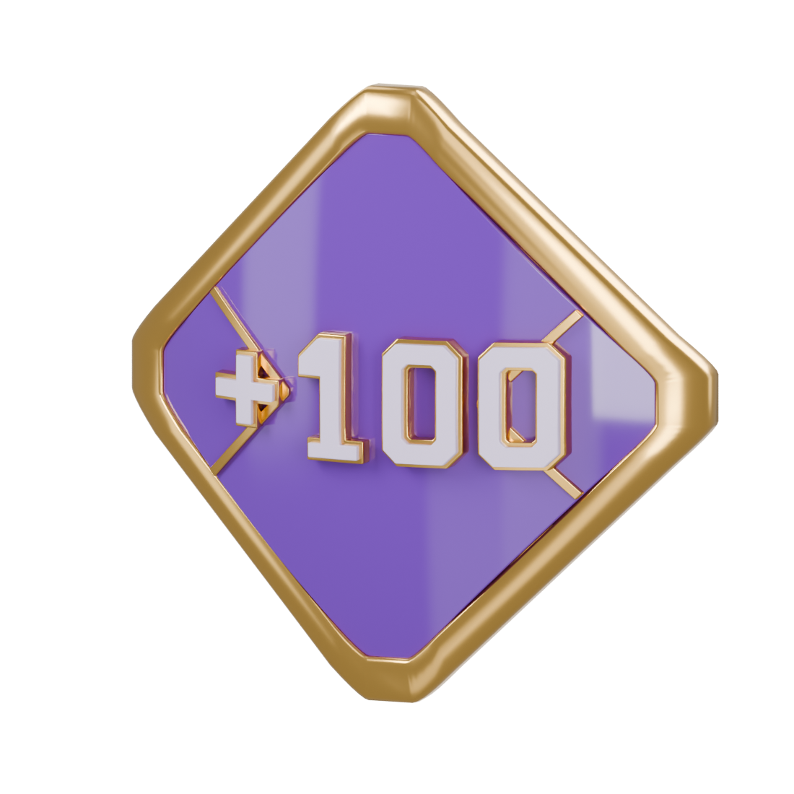
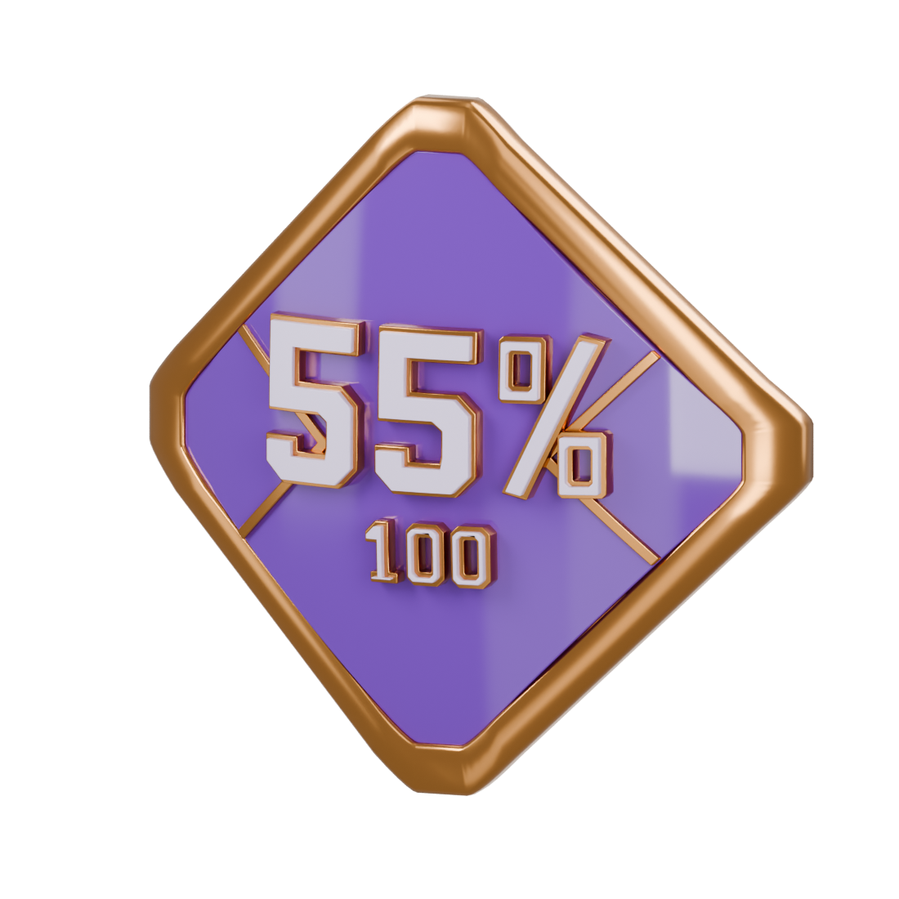
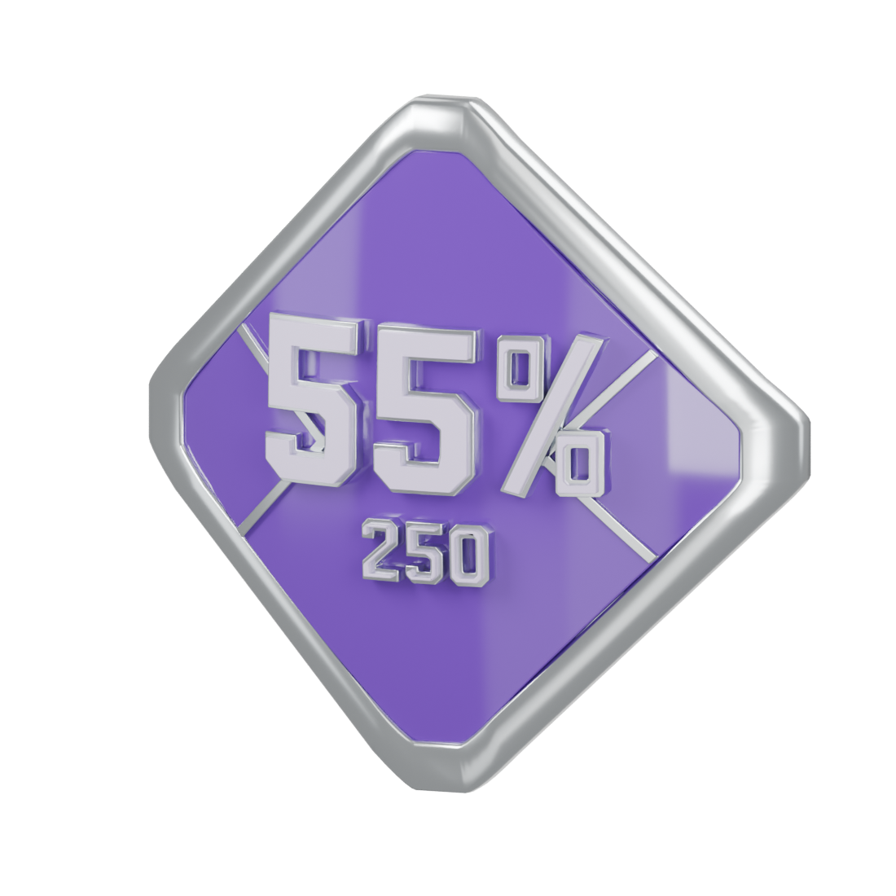
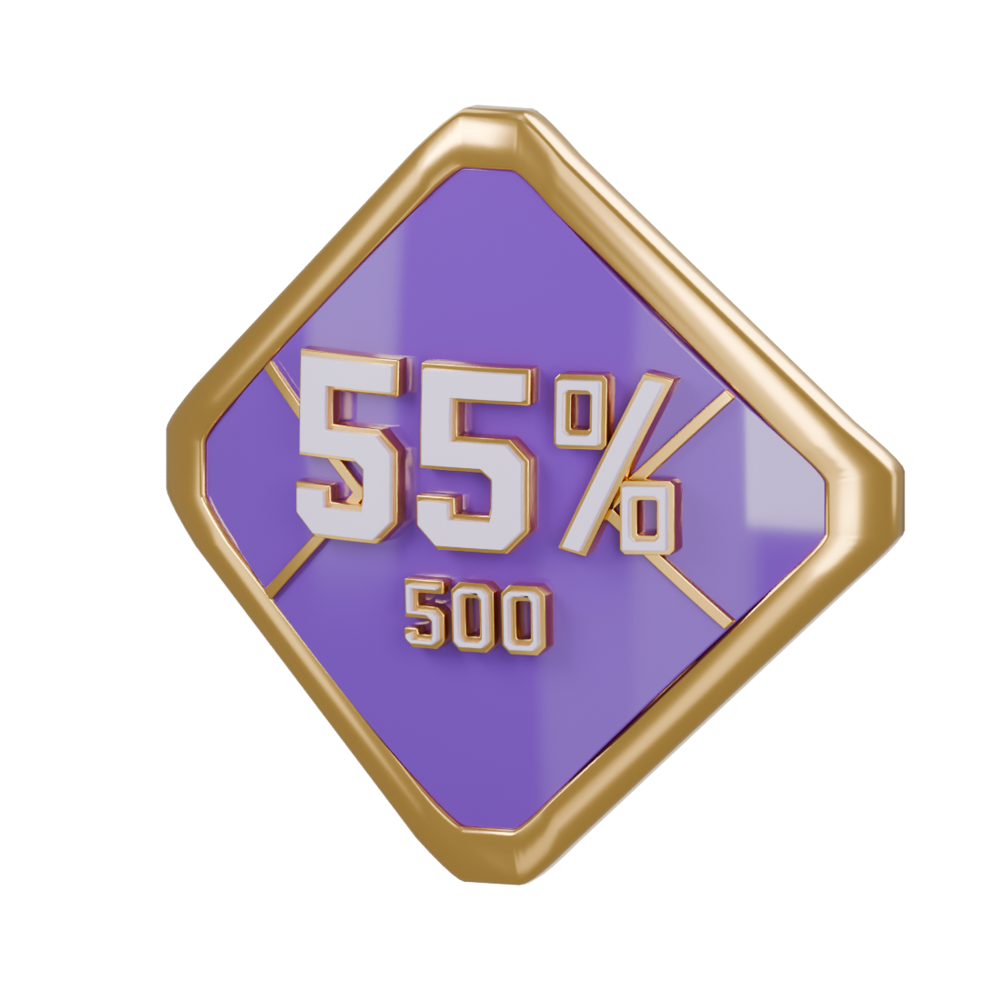

# Performance medals

Actual Blender models and reimported USDZ renders. Bodies, reverse, and front details share the approved bow.

## FIRST WIN

[Blender](first-win/first-win.blend) · [USDZ](first-win/first-win.usdz)

## +10 UNITS

[Blender](plus-10-units/plus-10-units.blend) · [USDZ](plus-10-units/plus-10-units.usdz)

## +25 UNITS

[Blender](plus-25-units/plus-25-units.blend) · [USDZ](plus-25-units/plus-25-units.usdz)

## +50 UNITS

[Blender](plus-50-units/plus-50-units.blend) · [USDZ](plus-50-units/plus-50-units.usdz)

## +100 UNITS

[Blender](plus-100-units/plus-100-units.blend) · [USDZ](plus-100-units/plus-100-units.usdz)

## CONSISTENT

[Blender](consistent/consistent.blend) · [USDZ](consistent/consistent.usdz)

## PROVEN CONSISTENCY 250

[Blender](consistent-250/consistent-250.blend) · [USDZ](consistent-250/consistent-250.usdz)

## PROVEN CONSISTENCY 500

[Blender](consistent-500/consistent-500.blend) · [USDZ](consistent-500/consistent-500.usdz)

Review assets only. Runtime integration and device testing remain later work.
