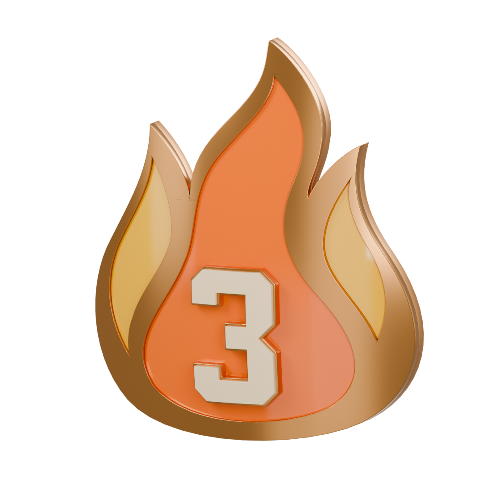

# Streaks medals

Actual Blender models and reimported USDZ renders. Bodies, reverse, and front details share the approved bow.

## 3 WIN STREAK

[Blender](streak-3/streak-3.blend) · [USDZ](streak-3/streak-3.usdz)

## 5 WIN STREAK

[Blender](streak-5/streak-5.blend) · [USDZ](streak-5/streak-5.usdz)

## 10 WIN STREAK

[Blender](streak-10/streak-10.blend) · [USDZ](streak-10/streak-10.usdz)

## 15 WIN STREAK

[Blender](streak-15/streak-15.blend) · [USDZ](streak-15/streak-15.usdz)

Review assets only. Runtime integration and device testing remain later work.

## Construction and validation

One continuous raised metal chassis encloses three separate curved acrylic cells. Cell openings are tessellated before curvature to preserve smooth metal reflections. The satin reverse remains solid. All front details and numerals follow the same approved bow.

`acrylic_center_cell` uses orange `#FF7100`; `acrylic_left_cell` and `acrylic_right_cell` use amber `#FFBF12`. Preserve these distinct color roles during eventual runtime recoloring.

All four source masters and reimported USDZs passed closed/outward mesh checks, finite vertex/normal checks, material bindings, Y-up, and absence of studio or sample text. Actual exported front/angle renders were inspected for all variants; bronze 3 also has top/back views. Per-variant manifests record the checks and curvature parameters.
