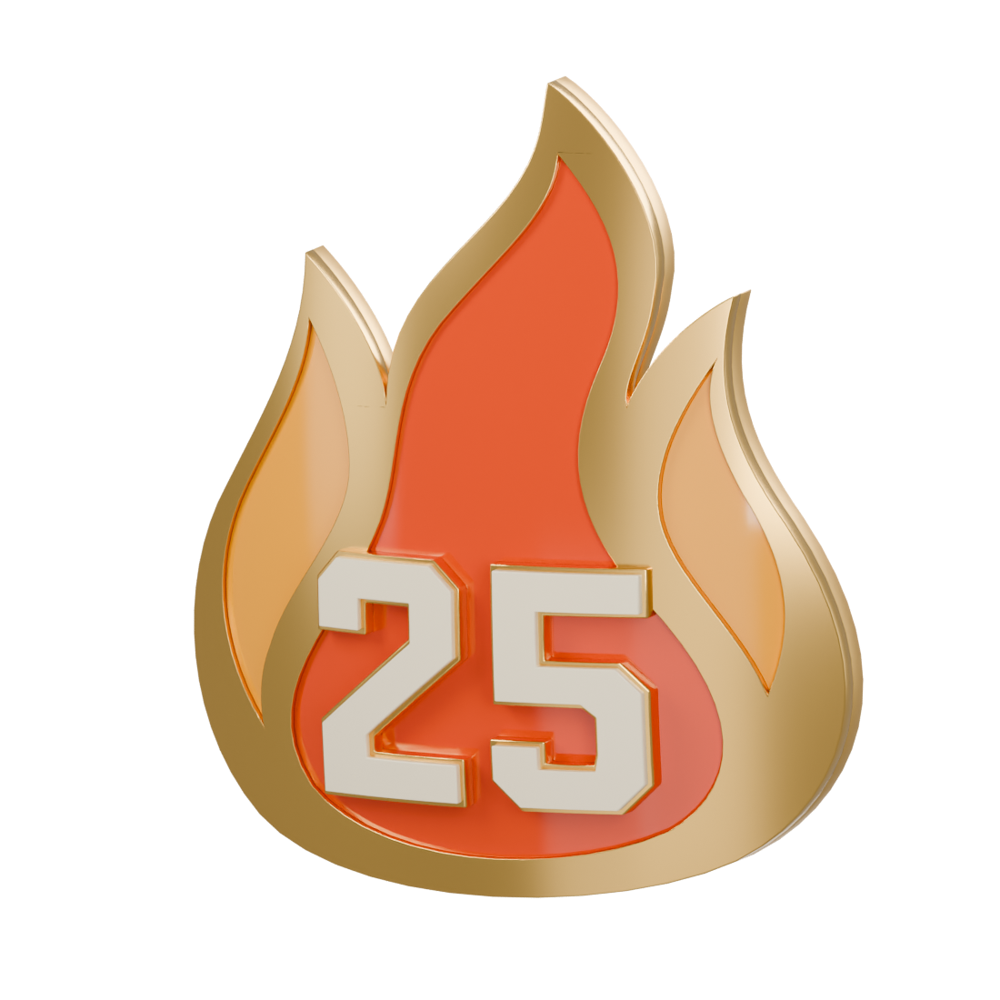

# Streaks medals

Actual Blender models and reimported USDZ renders. Bodies, reverse, and front details share the approved bow.

## 3 WIN STREAK

[Blender](streak-3/streak-3.blend) · [USDZ](streak-3/streak-3.usdz)

## 5 WIN STREAK

[Blender](streak-5/streak-5.blend) · [USDZ](streak-5/streak-5.usdz)

## 10 WIN STREAK

[Blender](streak-10/streak-10.blend) · [USDZ](streak-10/streak-10.usdz)

## 15 WIN STREAK

[Blender](streak-15/streak-15.blend) · [USDZ](streak-15/streak-15.usdz)

## 20 WIN STREAK

[Blender](streak-20/streak-20.blend) · [USDZ](streak-20/streak-20.usdz)

## 25 WIN STREAK

[Blender](streak-25/streak-25.blend) · [USDZ](streak-25/streak-25.usdz)

Review assets only. Runtime integration and device testing remain later work.
